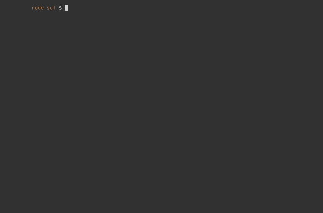
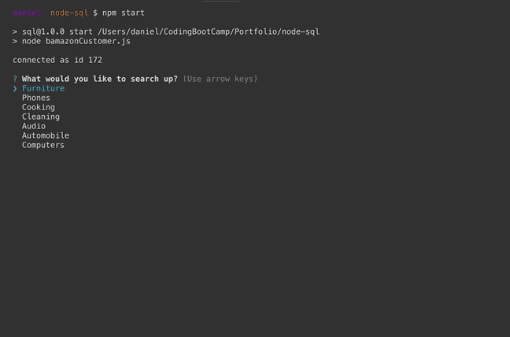
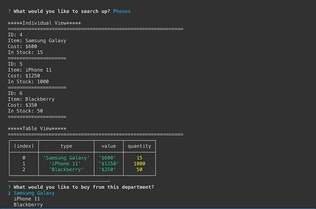
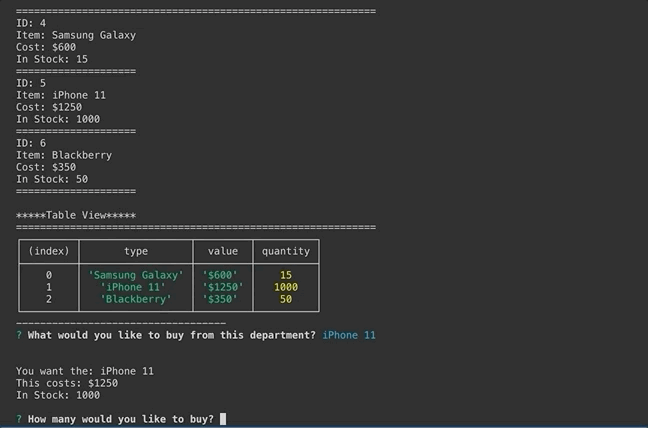

# node-sql
 
 
 
 
 
<h1> Welcome to BAMazon!</h1> 
<h6>Just as Cheap as Amazon!</h6>

<h1>Overview</h1>
 
In here we are using the technologies of:
<ul>
    <li>Inquirer</li>
    <li>MYSQL</li>
    <li>Node.js</li>
</ul>
 
 
<ol>
    <li>Inquirer 
    This is used to record the input of the user using node as an interface between the node.js scripts and the user
    </li>
    <li>MYSQL 
        <ul>
            <li>This is used as a database to Get, Read, and Update data that the app is showing</li>
        </ul>
    </li>
    <li>Node.js 
    This is being used to interface with your local MYSQL database 
    </li>
</ol>
 
 
<h1>Run Through</h1>
<ol>
    <li>first clone the repo from <h6>https://github.com/daniel-thao/node-sql<</h6></li>
    <li>You will also need to have MYSQL workbench and MAMP downloaded in order for this to work</li>
    <li>Start up your MAMP server</li>
    <li>Open up MYSQL Workbench</li>
    <li>After, populate your database by copy and pasting everything with the bamazon.sql file into your new Schema within your MYSQL Workbench</li>
    <li>Then open the program in your terminal by being in this directory <h6>node-sql/bamazonCustomer.js</h6></li>
    <li>Then run node and the file, can use npm start once you have installed all dependencies</li>
    <li>Once you run the application, You are presented with department options to shop from</li>
      <ol>
          <li>Furniture</li>
          <li>Phones</li>
          <li>Cooking</li>
          <li>Cleaning</li>
          <li>Audio</li>
          <li>Automobile</li>
          <li>Computers</li>
            
      </ol>
    <li>When you have chosen a department to shop from, you will be presented with what we have in stock and their costs! <h3>AMAZING</h3>
       
      <ol>
          <li>We have two view for you to check out if one is view is confusing!
                </li>
          <li>You can then choose what you want to buy</li>
      </ol>
    </li>
    <li>Once you choose what you want to buy, you will be presented with how many we have and how much it costs again just for you to double check!</li>
       
      <h3>How THOUGHTFUL of us!</h3>
          
    <li>You can then enter in how much you want to buy</li>
         
        <ol>
          <li>it must be in a numerical form otherwise it won't work
              </li>
          <li>If you want more than what we have in stock, then we unfortunately will haev to ask you to choose a lower amount
              </li>
        </ol>
     
    <li><h3>Once you've settled on what you want to buy, we'll calculate how much it will cost you</h3></li>
    <li>
        
    </li>
     
    <li>Finally, please shop with us again!, if not, when you vist again, we'll have the same amount of items in stock just for you!
         
          </li>
    </li>
</ol>
 
 
<h6>Well that's the app<h6>
<h4>I, Daniel Thao built the whole thing</h4>

 
 
 
 
 